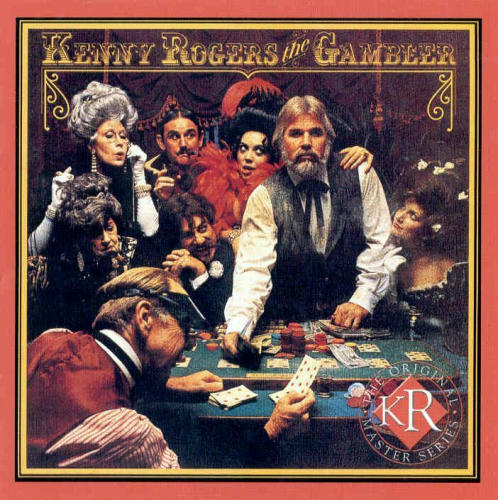

# The Gambler

On a warm summer's evenin' on a train bound for nowhere 
I met up with a gambler, we were both too tired to sleep 
So we took turns a-starin' out the window at the darkness 
'Til boredom overtook us and he began to speak 

And knowin' what their cards were 
By the way they held their eyes 
So if you don't mind my sayin', I can see you're out of aces 
For a taste of your whiskey I'll give you some advice 

So I handed him my bottle and he drank down my last swallow 
Then he bummed a cigarette and asked me for a light 
And the night got deathly quiet and his face lost all expression 
Said, "If you're gonna play the game, boy 
You gotta learn to play it right" 

You got to know when to hold 'em, know when to fold 'em 
Know when to walk away and know when to run 
You never count your money when you're sittin' at the table 
There'll be time enough for countin' when the dealing's done 

Every gambler knows that the secret to survivin' 
Is knowin' what to throw away and knowing what to keep 
'Cause every hand's a winner and every hand's a loser 
And the best that you can hope for is to die in your sleep 

And when he finished speakin' 
He turned back towards the window 
Crushed out his cigarette and faded off to sleep 
And somewhere in the darkness the gambler, he broke even 
But in his final words I found an ace that I could keep 

You got to know when to hold 'em, know when to fold 'em 
Know when to walk away and know when to run 
You never count your money when you're sittin' at the table 
There'll be time enough for countin' when the dealing's done 

You got to know when to hold 'em (When to hold 'em) 
Know when to fold 'em (When to fold 'em) 
Know when to walk away and know when to run 
You never count your money when you're sittin' at the table 
There'll be time enough for countin' when the dealing's done 
You got to know when to hold 'em, know when to fold 'em 
Know when to walk away and know when to run 
You never count your money when you're sittin' at the table 
There'll be time enough for countin' when the dealing's done 

In 2012 The gambler was remade with a modern flair.
It was called "Money Trees", The lyrics are not safe for work but we can all agree that money trees are the perfect place for shade.
